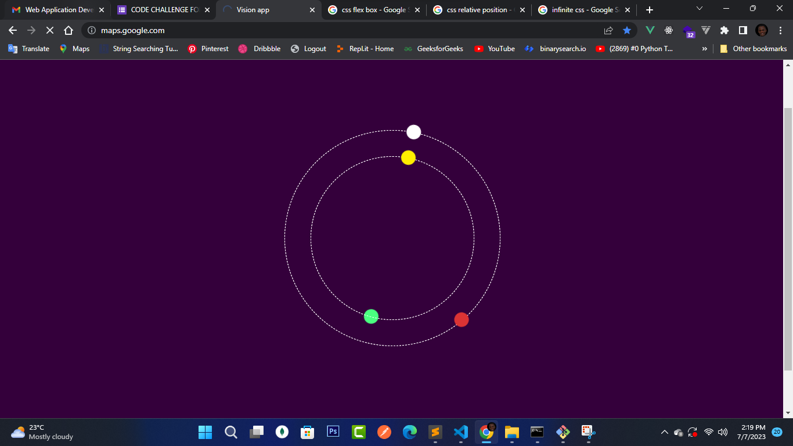

# Circles and balls Challenge

Two cicles with two balls rotating around at different speeds.
## Project Setup

```sh
npm install
```
### Compile and Hot-Reload for Development
```sh
npm run dev
```
### Compile and Minify for Production
```sh
npm run build
```
### Lint with [ESLint](https://eslint.org/)
```sh
npm run lint
```
# Project preview


